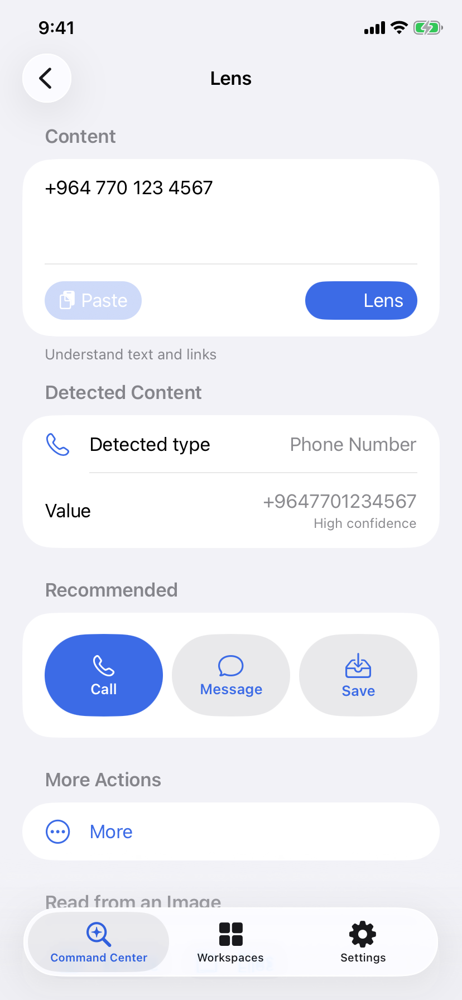
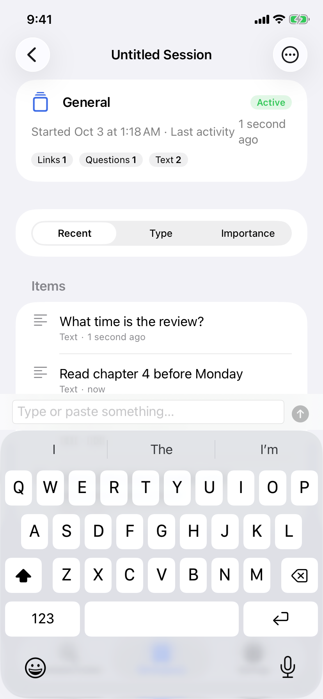
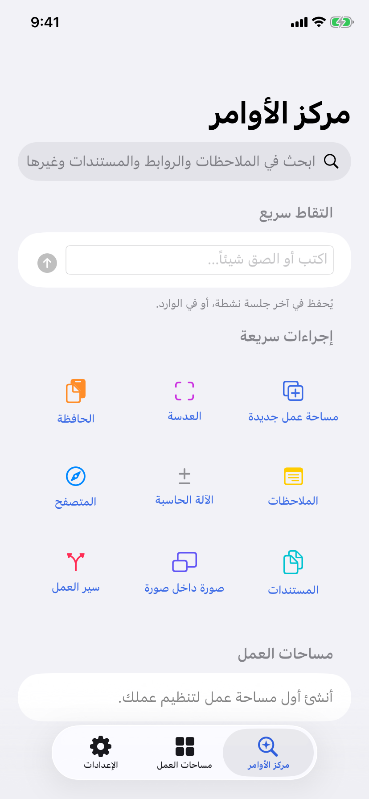
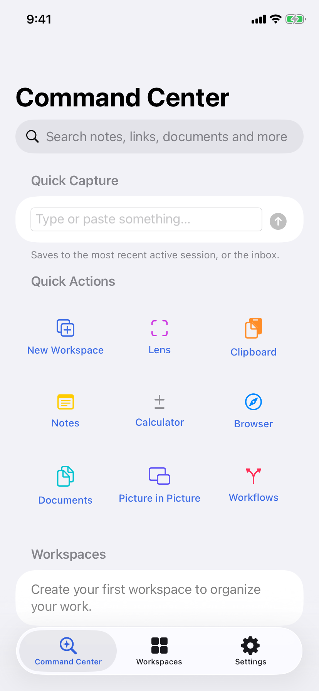

# TaskLens

Intelligent contextual multitasking for iPhone. Native Swift and SwiftUI, public iOS APIs only,
on-device first, English and Arabic (RTL).

> **Status (2026-10-07):** core app phases 0–18 are built and tested on CI. The presentation track
> (Roadmap v2, Track A) is at **A9.5.2** (PowerPoint failure screen); A9.5.3 (PDF fallback) waits for
> approval. The app is **not production-ready yet**: see [Release blockers](#release-blockers).
>
> Full documentation lives in the [Wiki](https://github.com/rayan23923-cell/multi_pip/wiki)
> and in [`docs/`](docs/).

<p>
  
  
  
  
  
</p>

## What it does

TaskLens turns whatever is on your screen or clipboard into the next action, and keeps related work
together. Everything runs on the device by default; the only network use is the optional AI server.

```
CONTENT ──► CONTEXT ──► ACTION ──► WORKSPACE ──► SESSION
```

| Area | Features |
|---|---|
| **Command Center** | Quick capture, recent sessions, tool shortcuts |
| **Workspaces** | Study, Work, Shopping, Developer and Custom workspaces, each with its tools and session type |
| **Smart Sessions** | Collect notes, links, documents, images, clipboard items and calculations; resume where you left off |
| **Productivity tools** | Notes, calculator, clipboard, in-app browser, documents, PDF viewer |
| **Action Lens** | Detects phone numbers, currencies, links, dates and more in text, images and PDFs (Vision OCR, barcodes, QR) and suggests actions you confirm |
| **Screen Lens** | iOS 27+ only, through the system `SCContentSharingPicker`; one frame, never stored |
| **Share Extension** | Send links, text, images and PDFs from any app into a session |
| **PiP Workspace** | A note, document page, session or calculator in native Picture in Picture |
| **Presentation** | Present PDFs, images and PowerPoint files with slide navigation, auto play, and per-file resume |
| **Smart Search** | Keyword search across everything, plus on-device semantic search (`NLEmbedding`) |
| **Workflows** | Trigger → steps → result automations (OCR, extract, convert currency, calculate, save, optional AI) |
| **System integration** | App Intents and Shortcuts, `tasklens://` links, Home Screen widgets, Live Activities |
| **Optional AI** | Apple Intelligence where available, or your own HTTPS server (off by default, key in Keychain) |

## Roadmap

**Original plan (phases 0–18): built.** Reports are in [`docs/reports/core`](docs/reports/core).

| Phase | Scope | Status |
|---|---|---|
| 0–1 | Repository assessment and audit | ✅ |
| 2 | Core architecture | ✅ |
| 3 | Command Center and Workspaces | ✅ |
| 4 | Productivity tools | ✅ |
| 5 | Smart Clipboard and Share Extension | ✅ |
| 6 | Context Engine and Action Engine | ✅ |
| 7 | Smart Sessions | ✅ |
| 8 | PiP Workspace | ⚠️ Partial: iOS only allows PiP from video layers |
| 9–15 | App Intents, widgets, Live Activities, Action Lens, Screen Lens, optional AI, Smart Search, Workflows | ✅ |
| 16 | Production hardening | ✅ |
| 17 | App Store compliance documents | ✅ |
| 18 | Final QA | ✅ Report done; verdict: not production-ready |

**Unified Master Roadmap v2.0** ([summary](docs/roadmap/roadmap-v2-summary.md)). Each phase is
inspect, implement, build, test, commit, report, then stop for approval.

| Track | Phases | Status |
|---|---|---|
| **A** Presentation | A1 model, A2 engine, A3 PDF, A4 images, A5 UI, A6 auto play, A7 session, A8 PowerPoint audit, A9 PowerPoint | ✅ A1–A9.4, A9.5.1, A9.5.2 · ⏸ A9.5.3–A9.5.6 next |
| **B** PiP | B1–B8 | Not started (YouTube feasibility done, see below) |
| **C** Notes | C1–C8 | Not started |
| **D** Whiteboard | D1–D6 | Not started |
| **E** Hotspot Web Receiver | E1–E18 | Not started |
| **F** Integration | F1–F9 | Not started |

Presentation reports are in [`docs/reports/presentation`](docs/reports/presentation).
The YouTube → PiP study is in [`docs/reports/research`](docs/reports/research/youtube-pip-feasibility-report.md):
YouTube plays inside TaskLens with the official player and opens in the YouTube app; native PiP for
YouTube is not possible with public APIs.

## Release blockers

From the [Phase 18 report](docs/reports/core/phase18-final-qa-report.md):

1. No app icon.
2. Placeholder identifiers (`com.example.tasklens`), no signing.
3. Not yet tested on a real iPhone for camera, Safari sharing, widgets, Live Activities and launch time.
4. A decision is needed on the PiP `audio` background mode (App Review guideline 2.5.4).
5. Two accessibility audit tests fail: Dynamic Type on the Screen Lens section. Dark-mode contrast needs work.

## Requirements

- Xcode 26 or newer (Swift 6 language mode)
- iOS 17.0 deployment target; reference device: iPhone 11
- [XcodeGen](https://github.com/yonaskolb/XcodeGen) to generate the Xcode project (`brew install xcodegen`)

## Getting started

```sh
xcodegen generate        # creates TaskLens.xcodeproj (not committed)
open TaskLens.xcodeproj
```

Run every build and test suite on an iPhone 11 simulator, exactly as CI does:

```sh
scripts/ci.sh
```

## CI

All workflows are started by hand from the Actions tab.

| Workflow | What it does |
|---|---|
| `CI` | Builds the app and extensions, runs unit tests and (by default) XCUITests on an iPhone 11 simulator, then an unsigned Release archive |
| `Screenshots` | Captures the main screens into `docs/screenshots` |
| `PPTX audit probe` | Runs the A8 PowerPoint probe |
| `Publish wiki` | Copies `docs/wiki` to the GitHub Wiki (also runs when `docs/wiki` changes) |

To try the app on a real iPhone without a Mac, see [`docs/device-testing.md`](docs/device-testing.md)
(Codemagic unsigned IPA + Sideloadly).

## Layout

| Path | Contents |
|---|---|
| `App/TaskLens` | App shell: composition root, tabs, route mapping |
| `App/TaskLensShare` | Share Extension |
| `App/TaskLensWidgets` | Widgets and Live Activities |
| `App/TaskLensTests`, `App/TaskLensAppUITests` | App-level integration and UI tests |
| `Packages/TaskLensKit` | UI-free code: foundation, domain, persistence, core services |
| `Packages/TaskLensUI` | Localization, design system, navigation, feature modules |
| `Tools/` | Probes and audit tools (PowerPoint audit) |
| `scripts/strings.py` | Source of truth for UI strings (English and Arabic) |
| `docs/ARCHITECTURE.md` | Architecture and dependency rules |
| `docs/reports/` | Delivery report for every phase |
| `docs/wiki/` | Source of the GitHub Wiki |

## Localization

All user-facing text comes from `Packages/TaskLensUI/Sources/TLLocalization/Resources/Localizable.xcstrings`,
generated from `scripts/strings.py`. Add strings there, then run `python3 scripts/strings.py`.
Tests fail if a key is missing in English or Arabic.

## Before a device build

Replace the placeholder identifiers `com.example.tasklens` and `group.com.example.tasklens`
in `project.yml` with your own bundle ID and App Group, and set your development team.

---

## بالعربية

**TaskLens** تطبيق iPhone لتعدد المهام الذكي حسب السياق: يحوّل ما تنسخه أو تشاركه أو تصوّره إلى إجراء
مقترح، ويجمع العمل المرتبط في مساحات عمل وجلسات. يعمل على الجهاز أولاً، بالعربية والإنجليزية.

- **المنجز:** المراحل 0 إلى 18 من الخطة الأصلية، ومسار العرض التقديمي حتى **A9.5.2** (شاشة فشل PowerPoint).
- **التالي:** A9.5.3 (البديل عبر PDF)، بانتظار الموافقة.
- **الحالة:** ليس جاهزاً للنشر بعد (الأيقونة، والمعرّفات والتوقيع، والاختبار على جهاز حقيقي، وقرار وضع `audio` لـ PiP، وDynamic Type).
- **التقارير:** كل تقارير المراحل بالعربية والإنجليزية في [`docs/reports`](docs/reports)، والتوثيق الكامل في [الويكي](https://github.com/rayan23923-cell/multi_pip/wiki).
