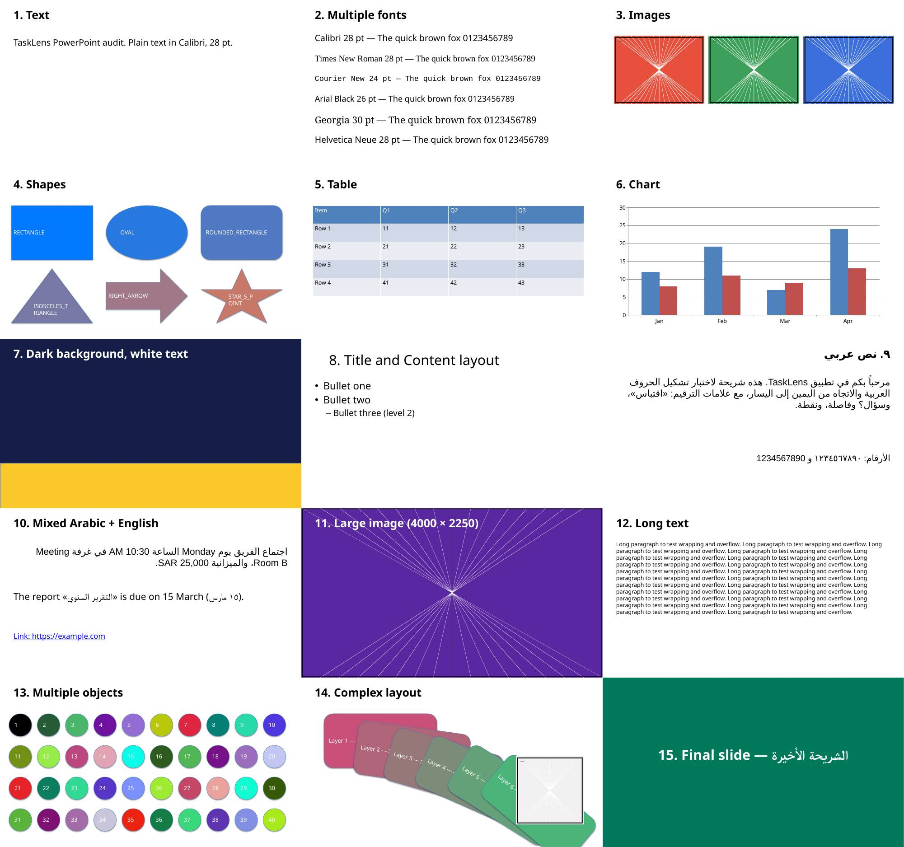
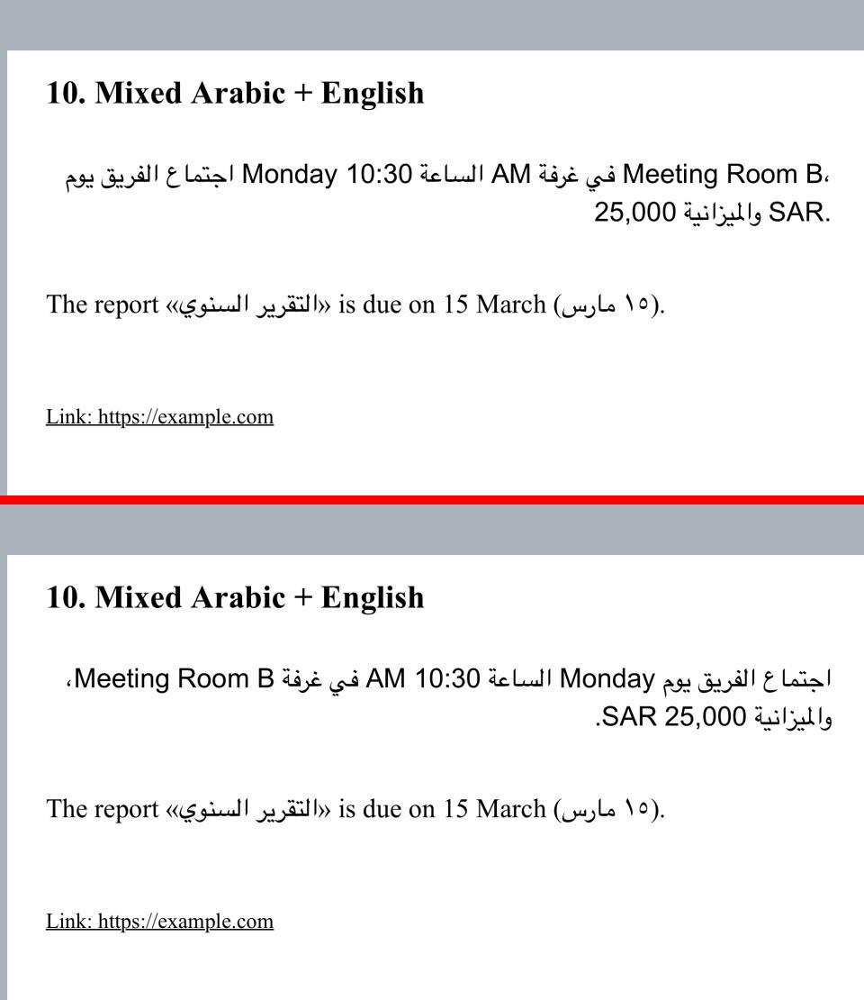
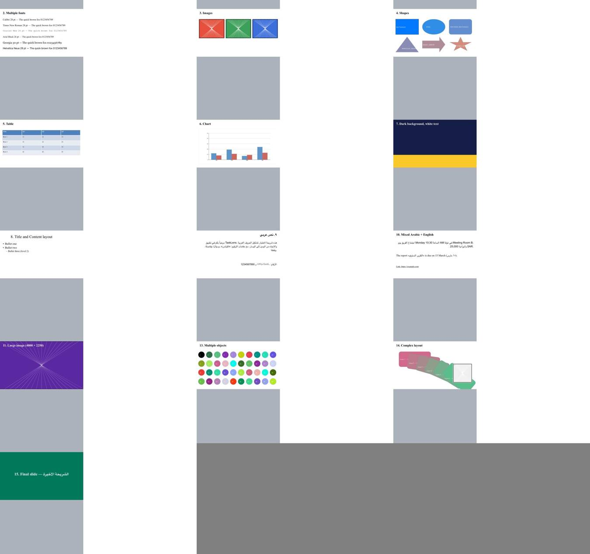

# A8: PowerPoint Technical Audit

A decision phase. It changes no app code and adds no dependency. The evidence comes from:
- an isolated probe (`Tools/PPTXAudit/Probe`, run by the manual workflow `pptx-audit.yml`) on an iPhone 11 simulator with iOS 26.5;
- a LibreOffice reference render;
- a desk review of options A–G.

Simulator timings are measurements. Device figures are **estimates** and are labelled as such.

## Test material

- `Tools/PPTXAudit/make_test_deck.py` builds `TaskLens-PPTX-Audit.pptx`, a 16:9 deck of 15 slides:
  1. text
  2. fonts
  3. images
  4. shapes
  5. table
  6. chart
  7. background
  8. layout
  9. Arabic
  10. mixed Arabic and English, with a hyperlink
  11. a 4000×2250 image
  12. long text
  13. 40 objects
  14. complex layout
  15. final slide
  
  Slides 1 and 12 carry speaker notes.
- `Tools/PPTXAudit/make_probe_decks.py` builds:
  - one deck per audit slide (`only-01` … `only-15`);
  - decks of 10, 50 and 100 slides, mixing Arabic, English and 1920×1080 photos;
  - hostile files: `.pptm`, a non-ZIP file, a ZIP bomb (300 MB inflated slide) and an XXE entity pointing at `file:///etc/hosts`.

## What the probe found

| Check | WKWebView (`loadFileURL`) | Quick Look (`QLPreviewController`, `QLThumbnailGenerator`) | LibreOffice (reference, Linux) |
|---|---|---|---|
| Audit deck, 15 slides | **Rejected** with OfficeImport error 912 "file format is invalid" | Preview stuck on "Loading…" | All 15 slides correct |
| Slides one by one | **13 of 15 render.** Only the 2 slides with speaker notes are rejected | Thumbnail of slide 9 OK (2.9 s) | All OK |
| Slide structure | One `div.slide` per slide (959×540) in a single scrolling page | Opaque, out of process; no slide API | One PDF page per slide |
| 10 / 50 / 100 slides | 1.5 / 1.8–2.0 / 4.5–7.1 s to load. App memory flat at about 51 MB (WebKit renders in its own process) | Preview scrolls all slides. Thumbnail of the 10-slide deck failed after 63 s | 1.7 / 3.0 / 5.1 s |
| Per-slide snapshot (`takeSnapshot`) | 0.00–0.02 s per slide | n/a | n/a |
| PDF from WebKit | `createPDF` makes one tall page. `UIPrintPageRenderer` at 960×540 gives exactly 1 page per slide (10 for 10) | n/a | Native |

The rejection of note-bearing decks was reproduced on files written by python-pptx. **Whether decks saved by PowerPoint or Keynote with notes are also rejected is unverified.** It must be checked on a device with real files before A9.

## ARABIC (critical)

- **Shaping:** letters join correctly in WebKit and in Quick Look, and Arabic-Indic digits display.
- **Direction is wrong** in WebKit and in Quick Look. They keep the right alignment but not the RTL paragraph direction (`dir=rtl` count = 0). The result:
  - On slide 9 the second sentence appears before the first.
  - Final punctuation lands on the wrong side (`.ونقطة`, `SAR.`).
  - In mixed text, "Meeting Room B" jumps to the start of the line.
  
  A Chromium render of the same text with `dir=ltr` reproduces exactly this pattern (`A8/chromium-bidi-reference.jpg`).
- **A one-line style fixes it in WebKit.** Injecting `p { unicode-bidi: plaintext }` gives each paragraph the direction of its first strong letter. Slides 9 and 10 then match the correct RTL reference. English paragraphs stay LTR, and the Arabic inside them stays in place.

  
  
- **Quick Look cannot be fixed**, because it renders out of process (`A8/quicklook-thumbnail-slide09.jpg` shows the same fault).
- **Fonts:** Calibri, Georgia and Arial Black are not on iOS, so WebKit falls back to Times. Arabic uses the system Arabic font. Embedded fonts were not tested.
- **LibreOffice** gets shaping, RTL, punctuation, numbers and mixed text right.

## VISUAL FIDELITY (WebKit, slides 2–15; LibreOffice for comparison)

| Slide | WebKit | LibreOffice |
|---|---|---|
| Text, long text | Good (font substituted) | Excellent |
| Fonts | Acceptable: all Latin fonts fall back to serif | Good |
| Images, large image | Excellent | Excellent |
| Shapes | Good; text in the shapes is small and serif | Excellent |
| Table | Good | Excellent |
| Chart | Good, drawn as an image | Excellent |
| Background | Excellent | Excellent |
| Title and content layout | Good | Excellent |
| Arabic, mixed | **Poor** as shipped; **Good** with the style fix | Excellent |
| 40 objects, complex layout | Good | Excellent |
| Speaker notes slides | **Unsupported** (deck rejected) | Excellent |

## ANIMATIONS, MEDIA, NOTES AND LINKS

- **Animations and transitions:** none of the approaches play them. The output is static, which fits TaskLens's slide model.
- **Video and audio:** not in the test deck and not tested. Treat them as unsupported.
- **Speaker notes:** WebKit and Quick Look never show them, and WebKit refused the decks that had them. Reading notes would need our own parse of `ppt/notesSlides/*.xml`, which is out of A8's scope (see FUTURE IMPROVEMENT).
- **Hyperlinks:** WebKit keeps them as `<a href>`. In a static-image approach they are lost and would have to be blocked anyway.

## SECURITY

- **WebKit:**
  - The ZIP bomb and the non-ZIP file were rejected in about 1.5–2 s, with no crash and app memory unchanged. Parsing happens in WebKit's own process.
  - The XXE entity expanded to empty text, so no file content leaked. LibreOffice behaved the same way.
- **`.pptm`:** renders like `.pptx`. iOS never runs VBA, and nothing in TaskLens should extract it.
- **Quick Look:** `canPreview` returns true even for garbage. It goes by the extension, so it is not a validator.
- **Required guards for any import:**
  - a file size cap;
  - a ZIP pre-check (entry count, total uncompressed size, ratio, no `../` paths);
  - a non-persistent web data store;
  - deny every navigation except the file itself, and no network;
  - discard the web view after conversion.

## LICENSE AND APP STORE

- **WKWebView and Quick Look** are system frameworks: no licence, no size cost, and App Store safe.
- **LibreOffice/Collabora:** MPL-2.0, about 335 MB. Too heavy.
- **JS renderers** (`@aiden0z/pptx-renderer` is Apache-2.0; PPTXjs is MIT and stale): they would be new dependencies, which A8 forbids, and their RTL support is unverified.
- **Apryse:** commercial, price on quote.
- **ONLYOFFICE:** AGPL. Avoid.
- **Server conversion** (Gotenberg, CloudConvert, Microsoft Graph) breaks offline-first. It also means uploading user files, which needs privacy-label disclosure.

## PERFORMANCE AND STORAGE

**Measured on the simulator:**
- Loads take 1.5 s, 2 s and 4.5–7 s for 10, 50 and 100 slides.
- Snapshots take a few milliseconds per slide.

**Estimated for an iPhone 11:**
- Probably 1–3× the simulator times, so up to about 15 s for 100 photo-heavy slides. WebKit's own process will hold the whole deck while converting.

**Estimated storage:** a 1920×1080 JPEG per slide is about 150–300 KB.

| Slides | Storage (estimated) | Source files |
|---|---|---|
| 10 | 2–3 MB | 1.7 MB |
| 50 | 8–15 MB | 7.8 MB |
| 100 | 15–30 MB | 16 MB |

## WEB RECEIVER COMPATIBILITY

- **Static slide images:** best. Any browser can show them, and the original file never leaves the phone (roadmap rule).
- **WebKit's HTML:** not portable, because it uses `x-apple-ql-id://` image URLs.
- **PDF via print rendering:** possible, but heavier.

## Ranked recommendation

| # | Approach | Offline | Fidelity | Arabic | Performance | Size | Web Ready | Complexity | Recommendation |
|---|---|---|---|---|---|---|---|---|---|
| 1 | **WKWebView → per-slide images** (B/C via Apple's OfficeImport) | Yes | Good | Good with the style fix | Good | 0 MB | Yes (images) | Medium | **Recommended** (verify notes decks first) |
| 2 | **G: user exports PDF** from PowerPoint or Keynote | Yes | Excellent (the author's own export) | Excellent | Excellent (A3) | 0 MB | Yes | None (works today) | **Fallback and day-one option** |
| 3 | A: Quick Look | Yes | Good | Poor, can't be fixed | Unreliable thumbnails | 0 MB | No | Low | Reject for presenting |
| 4 | D: JS renderer in WebKit | Yes | Unknown | Unverified | Unknown | ~2 MB | Partly | Medium | Reject (dependency) |
| 5 | E: native Swift / LibreOffice port | Yes | Low / Excellent | Unknown / Excellent | Unknown | — / ~335 MB | Yes | Very high | Reject |
| 6 | Commercial SDK (Apryse) | Yes | Excellent | Unverified | Good | Large | Yes | Medium | Reject (cost) |
| 7 | F: server conversion | **No** | Excellent | Excellent | Network-bound | 0 MB | Yes | High | Reference only |

## MVP DECISION

**A9 MVP: import `.pptx` (and `.ppsx`) by converting it on the device with WKWebView, then store a static image per slide and present it through the existing image path.**

The conversion steps:
1. Run the ZIP pre-check.
2. Load the file offline into a hidden, non-persistent WKWebView that denies all navigation.
3. Inject `p { unicode-bidi: plaintext }`.
4. Check that the number of `div.slide` equals the slide count in `ppt/presentation.xml`.
5. Snapshot each slide at 1920 px.
6. Drop the web view.

**When it fails, fall back to option G.** If WebKit rejects the file or the counts differ, show one clear message: "Export as PDF from PowerPoint or Keynote and import the PDF". Today's PDF path then handles it.

**Not in the MVP:**
- animations and transitions
- video and audio
- speaker notes
- live links
- `.ppt` (binary) and `.pptm`, which will be refused

**Condition before A9 starts:** check on a real iPhone that genuine PowerPoint and Keynote decks with speaker notes convert. If they do not, the MVP becomes G alone, plus a "convert to PDF" hint.

## ARCHITECTURAL IMPACT

- PPTX → slide images → the A4 image loader → `PresentationSlide`.
- **Unchanged:** the engine, state, auto play, session and the Web Receiver contract.
- **New parts, A9 only:**
  - a small ZIP central-directory reader for the pre-check and slide count (Foundation has none; no dependency needed);
  - a converter in the UI layer, because WebKit is a UI framework and Kit has none;
  - a storage folder per imported deck.
- **The session identity** (A7) becomes the imported deck's ID.

## KNOWN LIMITATIONS OF THIS AUDIT

- Only the simulator was used. No real-device run, and no decks written by PowerPoint or Keynote.
- WebKit's `div.slide` layout and OfficeImport are not a documented contract, so an iOS update could change them. The slide-count check and the PDF fallback contain that risk.
- WebKit process memory was not measured, only the app's.
- Embedded fonts, SmartArt, video, audio, 4:3 decks and `.ppsx` were not tested.

## FUTURE IMPROVEMENT (not approved, scope lock)

- **Speaker notes for the presenter view:**
  - Value: high for presenters.
  - Cost: medium (parse `notesSlides` XML with `XMLParser`).
  - Risk: low.
  - Dependency: the A9 ZIP reader.
